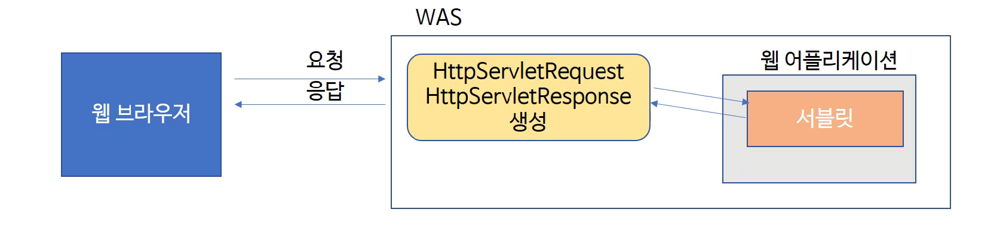

- **Request, Response 객체 이해하기** 

  - 요청과 응답

    WAS는 웹 브라우저로부터 Servlet요청을 받으면,

    - 요청할 때 가지고 있는 정보를 HttpServletRequest객체를 생성하여 저장합니다.
    - 웹 브라우저에게 응답을 보낼 때 사용하기 위하여 HttpServletResponse객체를 생성합니다.
    - 생성된 HttpServletRequest, HttpServletResponse 객체를 서블릿에게 전달합니다.

  - HttpServletRequest 

    - 클라이언트가 서버에게 보낸 요청을 추상화한 객체

  - HttpServletResponse

    - 서버가 클라이언트에게 응답하기 위한 정보를 추상화한 객체

  - 

  - 웹 브라우저에 URL을 입력하고 Enter 입력하면

    - 웹 브라우저는 도메인과 포트 번호를 이용해서 서버에 접속함
    - path 정보, 클라이언트의 IP, 클라이언트의 다양한 정보를 포함한 요청 정보를 서버에게 전송하게 됨
    - 객체 - 관련된 정보를 모아서 가지고 있는 것이 특징

  - 클라이언트로부터 요청이 들어오면 

    - WAS는 HttpServletRequest라는 객체와 HttpServletResponse라는 객체를 생성함
    - HttpServletRequest 객체에는, 요청할 때 가지고 들어온 다양한 정보들을 이 객체에 담음
    -  HttpServletResponse 객체 - 현재 접속한(이 요청을 보낸) 클라이언트 
      - 이 클라이언트에게 전송하기 위해 담을 수 있는, 정보를 담을 수 있는 객체에 HttpServlet Response 객체를 생성해주는 것
    - 이렇게 생성된 두 개의 객체를 요청 정보에 있는 path로 매핑된 서블릿에게 전달을 하게 되는 것
      - 이렇게 전달한 객체는 service(), doGet(), doPost() 같은 메서드에 파라미터로 전달돼서 사용하게 됨
    - HttpServletRequest 
      - HTTP 프로토콜의 request 정보를 서블릿에게 전달하기 위한 목적으로 사용
      - 헤더정보, 파라미터, 쿠키, URI, URL 등의 정보를 읽어 들이는 메소드를 가지고 있음
        - 요청할 때 가지고 있는 정보들을 모두 메서드로 담아요
        - 이 브라우저를, 요청한 사용자가 어떤 언어를 사용하고 있느냐 이런 등등에 대한 정보들까지 다 담음
      - Body의 Stream을 읽어 들이는 메소드를 가지고 있음
    - HttpServletResponse 
      - WAS - 어떤 클라이언트가 요청을 보냈는지 알고 있고, 해당 클라이언트에게 응답을 보내기 위한 HttpServletResponse 객체를 생성하여 서블릿에게 전달
      - 서블릿은 해당 객체를 이용해 content type, 응답코드, 응답 메시지 등을 전송

  - 클라이언트가 서버에게 요청 보낼 때 

    - 굉장히 많은 정보를 함께 가지고 요청을 하게 됨
    - 이 때 들어오는 요청 정보들이 어떤 것들이 있는가?
    - 요청할 때 가지고 들어오는 헤더 정보들이 존재

- 헤더 정보 읽어 들이기

  - 그냥 doGet 호출 => GET or POST로 요청이 들어오나 GET에다가 구현하면 똑같이 구현된 내용들이 들어오겠지

  ```java
  protected void doPost(HttpServletRequest request, HttpServletResponse response) throws ServletException, IOException{
      doGet(request, response);
  }
  ```

  - 응답 전 ContentType은 뭐야 알려주는 것 

  ```java
  response.setContentType("text/html");
  ```

  - 요청 객체로부터 응답을 보낼 통로를 알아와야지
    - 클라이언트와의 연결통로를 하나 가져오는 것

  ```java
  PrintWriter out = response.getWriter();
  ```

  - 그 다음 응답으로 보내줄 HTML 태그들이 들어있는 것 

  ```java
  out.println("<html>");
  out.println("<head><title>form</title></head>");
  out.println("</html>");
  ```

  - 헤더 정보는?

    - 요청이 들어올 때 모든 정보들은 WAS가 HttpServletRequest라는 객체를 만들어서  이 객체 안에다가 다 담아둬라고 설명했었음

    - 그 담아둔 객체를 우리는 doGet() 메소드에 파라미터로 가지고 들어옴

    - request한테 물어보면 다 알아낼 수 있음

    - `request.getHeaderNames()` 메소드

      ```java
      Enumeration<String> headernames = request.getHeaderNames();
      ```

      

      - 모든 헤더 이름을 문자열 Enumeration 객체로 반환

      - Enumeration 객체로 반환받음

        - while문을 통해서 알아보면 헤더의 name을 알아낼 수 있음

        ```java
        while(headernames.hasMoreElements()){
            String headerName = headernames.nextElement();
            String headerValue = request.getHeader(headerName);
            out.println(headername + " : " + headerValue + "<br>");
        // br를 포함    
        }
        ```

        

        - name을 알고 있으면 또 request가 갖고 있는 getHeader()라는 메서드
          - 헤더의 값 정보를 알아낼 수 있음
          - 브라우저에 출력하게 하고 싶음
        - 응답 결과에 담아줘야 될 것
          - out.println() 안에다가 넣어주면 OK!

- host는 누구도 이런 헤더가 가지고 있는 정보들이 다 들어 있음 
      
          - 메서드를 이용해 결과값을 알아낼 수도 있음
    
    - 파라미터를 읽어들여서 출력하는 서블릿 작성해보자!
    
      - URL 주소의 파라미터 정보를 읽어 들여 브라우저 화면에 출력
    
      - `http://localhost:8080/firstweb/param? name=kim&age=5`
    
        - URL에 보면 ?를 기준으로 뒤에 있는 것들을 파라미터
          - 중간에 &가 들어있음 => 기준점
          - &로 더 많은 파라미터를 전달 가능
          - `파라미터 이름 = 파라미터 값`
            - 클라이언트가 넘겨준 정보
            - 이 정보를 읽어들여 사용하자 
    
      - 항상 응답으로 보내기 위한 부분은 response 객체에다가 담는다.
    
      - 요청에 들어온 것들은 다 request가 가지고 있음
    
        - 내가 꺼내올 정보들은 request 객체로부터 얻어옴
    
      - 클라이언트와 연결 통로를 하나 열어준다고 생각
    
        - PrintWriter out = response.getWriter()
    
      - 응답한 내용이 HTML 
    
        - 텍스트지만, HTML의 형태를 갖추어서 넣어줌
    
        ```java
        out.println("<html>");
        ```
    
        - 값을 갖고 있는 것, 요청할 때 들고 들어온 값 중에는 이 파라미터 정보들이 있다
          - request한테 getParameter()라는 메서드 수행
          - `이름=값`의 형태 => getParameter('이름') = 값이 나옴
          - 다 문자열로 넘어옴
    
        ```java
        String name = request.getParameter("name");
        ```
    
        - 근데 하다보면 값이 null 나와
    
          - 요청한 URL을 보면, 뒤에 아무 것도 없지?
          - `http://localhost:8080/firstweb/param`이런 식이라 
          - 여기에서 값이 넘어가야 하는데, 
          - `http://localhost:8080/firstweb/param?name=kim&age=5`처럼 넘어가야 함
    - 바뀐 값을 가지고 응답 결과를 새로 만들어 냄
        
      - 거기에 따라 나오는 값이 달라짐 => 동적인 페이지
        - 이러한 파라미터들 반드시 URL을 통해서만 넘어오는 것은 아님
        - HTML form이라는 태그가 존재 
          - form 태그 안에는 input이라는 태그를 사용할 수 있음
          - input 태그 안에 들어있는 값
            - 똑같이 이 파라미터로 넘어오기 때문
            - 똑같은 방법으로 꺼내서 사용 ㄱㄱ
    
- 그 외의 요청정보 출력

     - URI, URL, PATH, Remote host 등에 대한 정보 출력
     - 응답은 똑같고, 출력하고 싶은 정보들이 있다면 넣어보자
     - get 메서드 - 가져와봐 이런 부분들 => 굉장히 많은 메서드들이 존재 
          - 더 다양한 정보들을 출력해보고 싶으면 이용해 테스트해보는 것도 좋음
          - uri - getRequestURI()가 return 해준 값
               - 도메인과 포트 이하에 있는 값을 return 하는 것을 볼 수 있음
               - 요청한 URL에서 포트 번호 이하, 우리 프로젝트명, 그 다음에 URL mapping에 적어줬던 이름, 이 부분이 나오고 있음
          - URL 과 URI 이런 것들 조금 구분해보자!
          - URI 정보 - 요청 주소 전체가 보이고 있는 것을 볼 수 있음
     - 웹 어플리케이션 생성 시 가장 마지막 단계에 contextPath 지정했었음
          - 기본적으로는 현재 프로젝트 이름이 contextPath로 지정이 됨
               - 나중에는 없앨 수도 있음 => / : 이렇게도 가능
          - 웹 어플리케이션과 매핑된 path
               - WAS 내에 웹 애플리케이션이 굉장히 여러 개 있을 수 있음
                    - 이 때 웹 Application을 찾아가는 이름 
                    - 우리가 프로젝트 만들 때 똑같이 아니라 거기에서 지정 가능
     - getRemoteAddr() - 출력해주는 클라이언트의 주소 값
          - 클라이언트가 요청 시 이 클라이언트의 주소 이런 부분들이 다 나와
          - 0:0:~~ => 현재 로컬 컴퓨터에서 접속을 했기 때문에 
          - 로컬 컴퓨터에서 접속하면 OS에 따라 로컬 호스트는 127.0.0.1 or localhost 이런 부분이 출력 가능
               - 운영체제가 IPv6 같은 경우 IP가 출력이 되는 경우 가능
          - 원격 컴퓨터가 접속했다면, 원격에 있는 컴퓨터의 IP가 출력됨
     - get하고 보면 request 객체가 클라이언트가 요청할 때 보내준 정보들을 모두 추상화해서 가지고 있는 객체
          - 이 객체로부터 원하는 값을 얻어서 사용할 수 있겠음!
